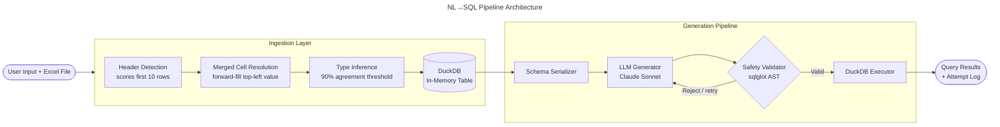
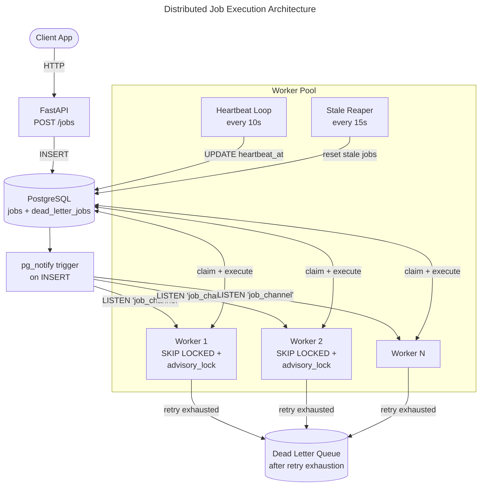
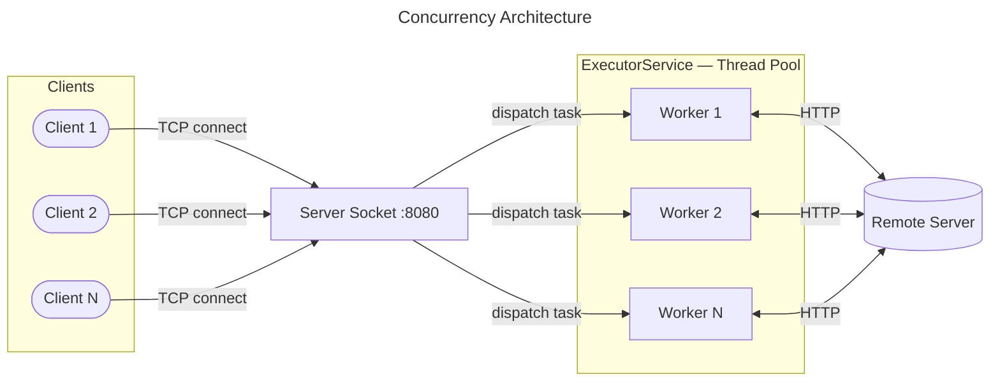
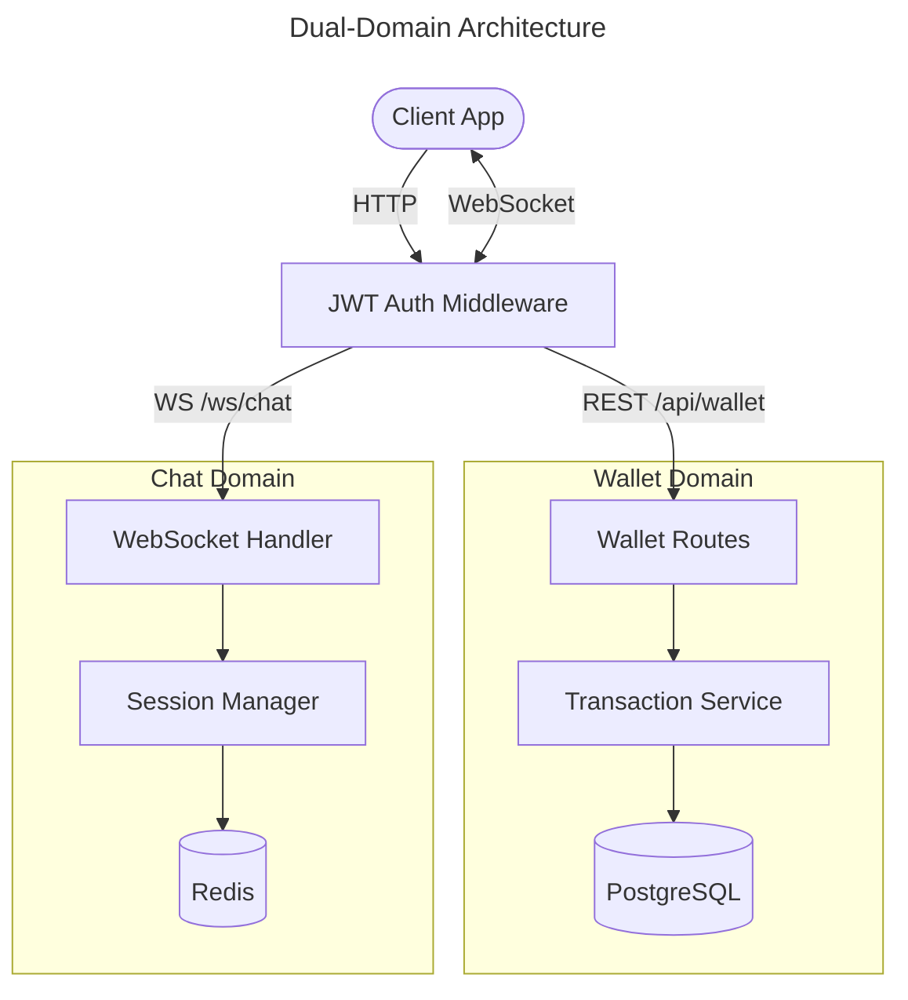

<!--
  ╔══════════════════════════════════════════════════════════╗
  ║             VISHWANATH BIRADAR — SYSTEM SPEC             ║
  ║        Backend Engineer · AI/ML Systems · SDE            ║
  ╚══════════════════════════════════════════════════════════╝
-->

<div align="center">

# Vishwanath Biradar

**`Backend Engineer`** &nbsp;·&nbsp; **`AI/ML Systems`** &nbsp;·&nbsp; **`Distributed Systems`**

<a href="https://www.linkedin.com/in/vishwanath-biradar-582b502a9/">
  
</a>
&nbsp;
<a href="mailto:vishwanathsbiradar1@gmail.com">
  
</a>
&nbsp;
<a href="https://x.com/Vishwanath_Birdr">
  
</a>
&nbsp;
<a href="https://github.com/Vishwanath090">
  
</a>

<br/>


</div>

---

<br/>

## `$ whoami`

```yaml
name:       Vishwanath Biradar
role:       Backend Engineer / AI-ML Systems / SDE
languages:  [Java, Python, JavaScript]
location:   India

philosophy: >
  Systems fail at their boundaries.
  I design around the boundaries first —
  failure modes, consistency tradeoffs, data flow —
  then write the code.

currently_targeting:
  - Backend SDE roles and internships
  - AI / LLM Engineering positions
  - Distributed systems infrastructure

open_to_work: true
```

I build **distributed systems**, **LLM-integrated pipelines**, and **scalable APIs** — with an emphasis on *correctness under failure*, not just correctness in the happy path. My work lives in the space where backend engineering meets AI infrastructure: building the reliability layers that make probabilistic systems behave like deterministic ones.

<br/>

---

## `$ cat EXPERTISE.md`

<table>
<tr>
<td width="50%" valign="top">

### ⚙️ Systems Depth

- **Java Concurrency** — thread safety, executor models, JVM internals, lock design
- **Async Python** — FastAPI, WebSockets, async I/O, event loop patterns
- **PostgreSQL Internals** — SKIP LOCKED, advisory locks, LISTEN/NOTIFY, MVCC
- **Distributed Patterns** — exactly-once execution, idempotency, TOCTOU elimination, dead-letter queuing
- **Event-Driven Architecture** — message delivery guarantees, partition-aware queuing

</td>
<td width="50%" valign="top">

### 🤖 AI / ML Depth

- **LLM Pipeline Engineering** — schema-aware generation, self-correction loops, retry budgets
- **RAG Architecture** — chunking strategies, hybrid retrieval, embedding models
- **Prompt Engineering** — structured output, context window management, safety validation at AST level
- **ML Frameworks** — TensorFlow, PyTorch, scikit-learn
- **Agent Architectures** — tool-use patterns, multi-step planning, evaluation harnesses

</td>
</tr>
</table>

<br/>

---

## `$ cat CAPABILITIES.yaml`

```yaml
languages:
  primary:    [Java, Python]
  secondary:  [JavaScript]

backend:
  frameworks: [Spring Boot, Spring Security, FastAPI, Django]
  protocols:  [REST, WebSockets, JWT, RabbitMQ]
  async:      [asyncpg, LISTEN/NOTIFY, event-driven patterns]

databases:
  relational: [PostgreSQL, MySQL]
  nosql:      [MongoDB, Redis, DuckDB]
  vector:     [learning: Qdrant, OpenSearch]

ai_ml:
  integration:    [LLM API integration, NL→SQL generation, self-correction loops]
  engineering:    [Prompt engineering, context window management, AST-level validation]
  frameworks:     [TensorFlow, PyTorch, scikit-learn]
  tooling:        [sqlglot, DuckDB, schema inference]

infrastructure:
  containers:   [Docker]
  observability: [Prometheus, Grafana, structured logging]
  tooling:      [Git, Swagger, Postman]
```

<br/>

---

## `$ ls -la PROJECTS/`

> Engineering projects built to understand systems at depth — not to pad a portfolio, but to hold an opinion about how distributed systems should work.

<br/>

### 🧠 `enterprise-nl2sql-engine` — Python · LLM APIs · DuckDB

**The insight:** Calling an LLM is trivial. Making that call *reliable* against real-world spreadsheets is the engineering problem.

This is a production-oriented NL→SQL engine for messy Excel and CSV datasets. The model sees a compact, fully-inferred schema and generates precise DuckDB SQL — which means the hard work is building everything *around* the model: schema inference that survives merged cells and numeric strings, and a safety validator that blocks all non-SELECT SQL at the **AST level** (never string matching).

```
Ingestion → Schema Inference → LLM Generation → AST Validation → DuckDB Execution
               ↑ handles messy headers,              ↑ SELECT-only, LIMIT-injected,
                 merged cells, mixed types              single-statement, schema-bound
```

| Metric | Result |
|--------|--------|
| Success rate within retry budget | **91.3%** across 23 test questions |
| Test coverage | **87 tests · 0 failures** |
| Fixture types covered | clean · multi-sheet · merged-cell · mixed-type · messy-header |

<details>
<summary><b>▶ Architecture diagram</b></summary>
<br/>



</details>

`Python` `FastAPI` `DuckDB` `LLM APIs` `sqlglot` `Prometheus` `Docker`

**[→ View Repository](https://github.com/vishwanath090/enterprise-nl2sql-engine)**

---

### 🔒 `PostgreSQL-Based-Distributed-Job-Scheduler-Processor` — Python · PostgreSQL

**The insight:** Exactly-once execution needs two locks. Either primitive alone is insufficient — and most queue implementations get this wrong.

A production-grade job queue built entirely on PostgreSQL — no Redis, no Celery, no external broker. The core is a two-phase locking strategy: `SELECT FOR UPDATE SKIP LOCKED` eliminates the TOCTOU race at claim time; `pg_try_advisory_lock` closes the window between commit and handler completion. `LISTEN/NOTIFY` replaces Redis pub/sub for push-driven wakeup. A heartbeat loop and stale reaper handle crashed workers without losing already-completed work.

The exactly-once guarantee is *verified*, not claimed — math verification jobs (SHA-256 chains, primality tests, Collatz sequences) check every result against pre-computed ground truth.

| Benchmark | Result |
|-----------|--------|
| Enqueue throughput (10k jobs, concurrency 50) | **2,604 jobs/s** |
| End-to-end throughput | **535 jobs/s · p99 3.44s** |
| Math verification (600 jobs, concurrency 30) | **600/600 correct · 0 double-executions** |
| Test suite | **35 tests · 0 failures** |

<details>
<summary><b>▶ Architecture diagram</b></summary>
<br/>



</details>

`Python` `FastAPI` `PostgreSQL` `asyncpg` `SKIP LOCKED` `Advisory Locks` `LISTEN/NOTIFY` `Docker`

**[→ View Repository](https://github.com/vishwanath090/PostgreSQL-Based-Distributed-Job-Scheduler-Processor)**

---

### 🌐 `multithreaded-http-proxy-server` — Java

**The insight:** You can't reason about thread contention until you've built the system that creates it.

A fully custom HTTP proxy server with no framework scaffolding — built to understand Java concurrency at the systems level. Custom thread pool over `ExecutorService`, full socket lifecycle management, HTTP parsing from scratch. The challenge wasn't making it work; it was understanding *where contention emerges* and designing the resource-sharing model before writing a line of handler code.

<details>
<summary><b>▶ Architecture diagram</b></summary>
<br/>



</details>

`Java` `Thread Pooling` `Socket Programming` `HTTP Parsing` `ExecutorService`

**[→ View Repository](https://github.com/vishwanath090/multithreaded-http-proxy-server)**

---

### 💳 `payment-wallet-chat-backend` — Python · FastAPI

**The insight:** Consistency-first and availability-first are fundamentally different contracts. A single backend can support both — if you respect the boundary.

A backend that serves two domains with different consistency requirements in the same service. The wallet layer enforces atomic balance updates and idempotent operations. The WebSocket chat layer manages stateful, low-latency messaging. JWT middleware gates both surfaces from a shared layer — neither domain bleeds into the other's lifecycle model.

<details>
<summary><b>▶ Architecture diagram</b></summary>
<br/>



</details>

`FastAPI` `WebSockets` `PostgreSQL` `JWT` `Idempotency Patterns`

**[→ View Repository](https://github.com/vishwanath090/payment-wallet-chat-backend)**

---

### 📖 `Ai_Story_Generator` — Python · LLM APIs

**The insight:** The API call is 5% of the problem. Managing context, coherence, and failure across generation steps is the other 95%.

A generative narrative engine with structured prompt sequencing, context window management across multi-turn generation, and failure handling for non-deterministic outputs. The goal was production-grade reliability from an inherently probabilistic system.

`Python` `LLM APIs` `Prompt Engineering` `Context Window Management`

**[→ View Repository](https://github.com/vishwanath090/Ai_Story_Generator-)**

---

### 🔑 `Decentralised-Identity-Verification` — JavaScript

**The insight:** Identity is a verifiable proof chain — not a database row.

An identity management system built on cryptographic primitives instead of a central authority. Implements digital signature verification and decentralised trust models inspired by blockchain architecture — an exploration of how authentication can be redesigned at the trust-model level.

`JavaScript` `Cryptographic Identity` `Digital Signatures` `Decentralised Trust`

**[→ View Repository](https://github.com/vishwanath090/Decentralised-Identity-Verification)**

<br/>

---

## `$ tail -f LEARNING_LOG`

```
[ACTIVE]  RAG pipeline architecture     → chunking, embedding models, hybrid retrieval
[ACTIVE]  High-performance Java         → JVM internals, GC tuning, Project Reactor
[ACTIVE]  Distributed systems at scale  → Kafka, consensus protocols, partition-aware queuing
[ACTIVE]  Observability engineering     → structured logging, distributed tracing, SLO alerting
[ACTIVE]  Agent architectures           → tool-use, multi-step planning, eval harnesses
```

<br/>

---

## `$ git log --oneline METRICS`

<div align="center">


&nbsp;&nbsp;


<br/><br/>


</div>

<br/>

---

## `$ ping CONTACT`

Open to **Backend SDE**, **Software Engineer**, and **AI/LLM Engineering** roles and internships.

```
vishwanathsbiradar1@gmail.com
linkedin.com/in/vishwanath-biradar-582b502a9
github.com/Vishwanath090
```

<br/>

---

<div align="center">

```
┌─────────────────────────────────────────────────────────────┐
│   I don't just write code that works.                       │
│   I build systems that fail predictably — and recover.      │
└─────────────────────────────────────────────────────────────┘
```

</div>
