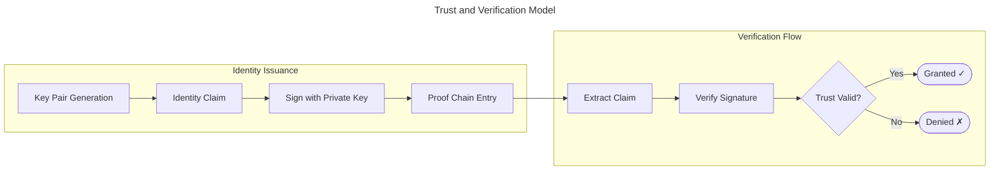

<div align="center">

# Vishwanath Biradar

**Backend Engineer &nbsp;·&nbsp; SDE &nbsp;·&nbsp; AI/LLM Systems**

[LinkedIn](https://www.linkedin.com/in/vishwanath-biradar-582b502a9/) &nbsp;·&nbsp;
[Email](mailto:vishwanathsbiradar1@gmail.com) &nbsp;·&nbsp;
[X / Twitter](https://x.com/Vishwanath_Birdr)

</div>

---

Backend engineer focused on distributed systems, scalable API design, and AI-integrated infrastructure. I work primarily in **Java** and **Python** — across REST services, async messaging, event-driven architecture, and LLM pipelines — with an emphasis on correctness, fault tolerance, and production-grade thinking.

Currently targeting **Backend SDE**, **Software Engineer**, and **AI/LLM Engineering** roles and internships.

---

## Engineering Approach

I reason from first principles: understanding data flow, failure boundaries, and consistency tradeoffs before writing code. I build from scratch before reaching for abstractions — not to avoid libraries, but because understanding the systems layer informs how to use them well.

Areas of active depth:

- REST and event-driven service architecture
- Java concurrency — thread safety, executor models, JVM internals
- Async Python — FastAPI, WebSockets, async I/O patterns
- LLM pipeline integration — schema-aware generation, self-correction loops, safety validation
- Distributed system patterns — exactly-once execution, advisory locks, SKIP LOCKED semantics, message delivery guarantees

---

## Technical Stack

| Area | Technologies |
|---|---|
| **Languages** | Java · Python · JavaScript |
| **Backend & APIs** | Spring Boot · Spring Security · FastAPI · Django · REST · WebSockets · JWT · RabbitMQ · asyncpg |
| **Databases** | PostgreSQL · MySQL · MongoDB · Redis · DuckDB |
| **AI / ML & RAG** | LLM API integration · NL→SQL generation · Prompt engineering · TensorFlow · PyTorch · scikit-learn |
| **Tooling** | Docker · Git · Swagger · Postman · Prometheus · Grafana · sqlglot |

---

## Projects

### Enterprise NL→SQL Engine &nbsp;—&nbsp; Python, LLM APIs

A production-oriented natural language to SQL engine for real-world Excel and CSV datasets. The engineering problem isn't calling an LLM — it's building the layers around it that make it reliable: schema inference from messy spreadsheets, a safety validator that blocks all non-SELECT SQL at the AST level, and a self-correction loop that retries intelligently on failure.

This is schema-aware SQL generation, not RAG. No chunking, no embeddings, no vector retrieval. The model sees a compact, fully-inferred schema and generates precise DuckDB SQL against it — which means the hard work is in getting the schema right from files that were never designed to be queried.

The ingestion layer handles the real world: headers not on row 1, merged cells, mixed-type columns, numeric strings, duplicate names. The safety validator uses `sqlglot` AST parsing — never string matching — and enforces SELECT-only, single-statement, schema-bound queries with automatic LIMIT injection. The system runs 87 tests across three layers, with the validator carrying the highest coverage by design.

<details>
<summary><b>▶ View architecture — NL→SQL Pipeline</b></summary>

<br/>


</details>

**Benchmark:** 91.3% success within retry budget across 23 questions spanning clean, multi-sheet, merged-cell, mixed-type, and messy-header fixtures. 87 tests, 0 failures.

**Stack:** Python · FastAPI · DuckDB · LLM API integration · sqlglot · Prompt engineering · Prometheus · Docker

[→ Repository](https://github.com/vishwanath090/enterprise-nl2sql-engine)

---
### PostgreSQL-Based Distributed Job Scheduler &nbsp;—&nbsp; Python

A production-grade background job queue built entirely on PostgreSQL — no Redis, no Celery, no external message broker. The engineering challenge was achieving exactly-once execution with durable ordering and horizontal scaling using only PostgreSQL primitives.

The core is a two-phase locking strategy. `SELECT … FOR UPDATE SKIP LOCKED` eliminates the TOCTOU race at claim time: two workers cannot hold an exclusive row lock on the same row simultaneously, and a slow worker doesn't cause queue head-of-line blocking. But this lock releases when the claim transaction commits, leaving a window between commit and handler completion. `pg_try_advisory_lock` closes it — session-scoped, non-blocking, automatically released on worker crash. Either primitive alone is insufficient; together they form a complete exactly-once guarantee across the full job lifecycle.

`LISTEN/NOTIFY` replaces Redis pub/sub for push-driven worker wakeup, with a 5-second polling fallback for missed notifications during restarts. A heartbeat loop and stale reaper handle crashed workers: jobs are reset to `pending` without manual intervention, without losing the result of work already done.

The exactly-once guarantee isn't claimed — it's verified. A math verification benchmark runs CPU-bound jobs (SHA-256 chains, is_prime, Collatz sequences) and checks every result against pre-computed ground truth. 600 jobs, 0 incorrect results, 0 double executions.

<details>
<summary><b>▶ View architecture — Distributed Execution Model</b></summary>

<br/>


</details>

**Load benchmark** *(noop handlers, 10,000 jobs, concurrency 50, 4 workers):*
2,604 enqueues/s · 535 end-to-end jobs/s · p50 0.71s · p99 3.44s

**Math verification benchmark** *(SHA-256 8k rounds · is_prime · Collatz, 600 jobs, concurrency 30):*
600/600 correct · 100% accuracy · 0 double-executions · p50 917ms · p99 2.84s

**35 tests, 0 failures** — DLQ transitions, exactly-once proof, priority ordering, retry backoff, stale reaper recovery, advisory lock contention.

**Stack:** Python · FastAPI · PostgreSQL · asyncpg · `SKIP LOCKED` · Advisory locks · `LISTEN/NOTIFY` · Docker

[→ Repository](https://github.com/vishwanath090/PostgreSQL-Based-Distributed-Job-Scheduler-Processor)
---

### Multithreaded HTTP Proxy Server &nbsp;—&nbsp; Java

A fully custom HTTP proxy server built without framework scaffolding — designed to understand Java concurrency at the systems level rather than through library abstractions.

The core engineering work: building a custom thread pool over `ExecutorService`, managing socket lifecycle and HTTP parsing end-to-end, and designing for safe resource sharing across concurrent connections. The challenge wasn't getting it to work — it was understanding where thread contention emerges and designing around it from the start.

<details>
<summary><b>▶ View architecture — Concurrency Model</b></summary>

<br/>


</details>

**Stack:** Java · Thread pooling · Socket programming · HTTP parsing · `ExecutorService` internals

[→ Repository](https://github.com/vishwanath090/multithreaded-http-proxy-server)

---

### Payment Wallet + Real-Time Chat Backend &nbsp;—&nbsp; Python

A backend that handles two domains with fundamentally different consistency requirements within the same service: a transactional payment wallet and a real-time messaging layer.

The REST layer enforces atomic balance updates and idempotent operations — consistency-first. The WebSocket layer manages async, stateful chat — availability and low latency. The architectural problem was keeping these domains cleanly decoupled while sharing auth infrastructure. JWT middleware gates both surfaces from a shared layer; neither domain bleeds into the other's lifecycle model.

<details>
<summary><b>▶ View architecture — Dual-Domain Design</b></summary>

<br/>


</details>

**Stack:** FastAPI · WebSockets · PostgreSQL · JWT · REST API design · Idempotency patterns

[→ Repository](https://github.com/vishwanath090/payment-wallet-chat-backend)

---

### AI Story Generator &nbsp;—&nbsp; Python, LLM APIs

A generative narrative engine built around language model APIs — focused on the engineering layer, not the model layer.

The interesting work wasn't calling the API. It was structuring prompt sequences for multi-turn coherence, managing context windows across generation steps, and handling the failure modes that come with non-deterministic outputs. The goal: production-grade reliability from an inherently probabilistic system.

<details>
<summary><b>▶ View architecture — LLM Pipeline</b></summary>

<br/>


</details>

**Stack:** Python · LLM API integration · Prompt engineering · Context window management · Failure handling

[→ Repository](https://github.com/vishwanath090/Ai_Story_Generator-)

---

### Decentralised Identity Verification &nbsp;—&nbsp; JavaScript

An identity management system built on cryptographic primitives instead of a central authority. The core model: identity as a verifiable proof chain, not a database row.

Implements digital signature verification and decentralised trust models inspired by blockchain architecture — without a full chain. The engineering point was understanding how authentication can be redesigned at the trust model level, and how those patterns apply to practical backend systems.

<details>
<summary><b>▶ View architecture — Trust Model</b></summary>

<br/>



</details>

**Stack:** JavaScript · Cryptographic identity · Digital signatures · Decentralised trust · Web3 auth patterns

[→ Repository](https://github.com/vishwanath090/Decentralised-Identity-Verification)

---

## Currently Exploring

```
→  RAG pipeline architecture        — chunking strategies, embedding models, hybrid retrieval
→  High-performance Java            — JVM internals, GC tuning, Project Reactor
→  Distributed systems at scale     — Kafka, consensus protocols, partition-aware queuing
→  Observability engineering        — structured logging, tracing, SLO-based alerting
→  Agent architectures              — tool-use, multi-step planning, evaluation harnesses
```

---

## GitHub Activity

<div align="center">


&nbsp;&nbsp;


<br/><br/>


</div>

---

## Contact

Open to **backend engineering**, **SDE**, and **AI/LLM infrastructure** roles and internships.

**Email:** vishwanathsbiradar1@gmail.com  
**LinkedIn:** [vishwanath-biradar-582b502a9](https://www.linkedin.com/in/vishwanath-biradar-582b502a9/)  
**GitHub:** [Vishwanath090](https://github.com/Vishwanath090)

---

<div align="center">
<sub><i>I build to understand. The code follows.</i></sub>
</div>
