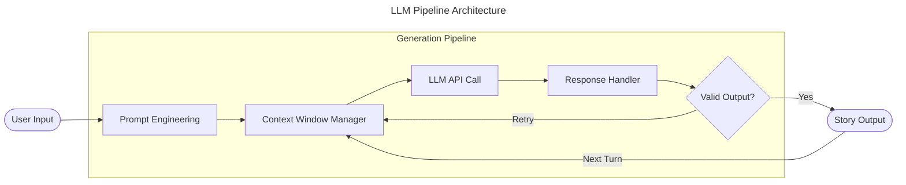

<div align="center">

# Vishwanath Biradar

**Backend Engineer &nbsp;·&nbsp; SDE &nbsp;·&nbsp; AI/LLM Systems**

[LinkedIn](https://www.linkedin.com/in/vishwanath-biradar-582b502a9/) &nbsp;·&nbsp;
[Email](mailto:vishwanathsbiradar1@gmail.com) &nbsp;·&nbsp;
[X / Twitter](https://x.com/Vishwanath_Birdr)

</div>

---

Backend engineer focused on distributed systems, scalable API design, and AI-integrated infrastructure. I work primarily in **Java** and **Python** — across REST services, async messaging, event-driven architecture, and LLM pipelines — with an emphasis on correctness, fault tolerance, and production-grade thinking.

Currently targeting **Backend SDE**, **Software Engineer**, and **AI/LLM Engineering** roles and internships.

---

## Engineering Approach

I reason from first principles: understanding data flow, failure boundaries, and consistency tradeoffs before writing code. I build from scratch before reaching for abstractions — not to avoid libraries, but because understanding the systems layer informs how to use them well.

Areas of active depth:

- REST and event-driven service architecture
- Java concurrency — thread safety, executor models, JVM internals
- Async Python — FastAPI, WebSockets, async I/O patterns
- LLM pipeline integration and RAG architecture
- Distributed system patterns — consistency models, message delivery guarantees, fault isolation

---

## Technical Stack

| Area | Technologies |
|---|---|
| **Languages** | Java · Python · JavaScript |
| **Backend & APIs** | Spring Boot · Spring Security · FastAPI · Django · REST · WebSockets · JWT · RabbitMQ |
| **Databases** | PostgreSQL · MySQL · MongoDB · Redis |
| **AI / ML & RAG** | LLM API integration · RAG pipeline design · TensorFlow · PyTorch · scikit-learn |
| **Tooling** | Docker · Git · Swagger · Postman |

---

## Projects

### Multithreaded HTTP Proxy Server &nbsp;—&nbsp; Java

A fully custom HTTP proxy server built without framework scaffolding — designed to understand Java concurrency at the systems level rather than through library abstractions.

The core engineering work: building a custom thread pool over `ExecutorService`, managing socket lifecycle and HTTP parsing end-to-end, and designing for safe resource sharing across concurrent connections. The challenge wasn't getting it to work — it was understanding where thread contention emerges and designing around it from the start.


**Stack:** Java · Thread pooling · Socket programming · HTTP parsing · `ExecutorService` internals

[→ Repository](https://github.com/vishwanath090/multithreaded-http-proxy-server)

---

### Payment Wallet + Real-Time Chat Backend &nbsp;—&nbsp; Python

A backend that handles two domains with fundamentally different consistency requirements within the same service: a transactional payment wallet and a real-time messaging layer.

The REST layer enforces atomic balance updates and idempotent operations — consistency-first. The WebSocket layer manages async, stateful chat — availability and low latency. The architectural problem was keeping these domains cleanly decoupled while sharing auth infrastructure. JWT middleware gates both surfaces from a shared layer; neither domain bleeds into the other's lifecycle model.


**Stack:** FastAPI · WebSockets · PostgreSQL · JWT · REST API design · Idempotency patterns

[→ Repository](https://github.com/vishwanath090/payment-wallet-chat-backend)

---

### AI Story Generator &nbsp;—&nbsp; Python, LLM APIs

A generative narrative engine built around language model APIs — focused on the engineering layer, not the model layer.

The interesting work wasn't calling the API. It was structuring prompt sequences for multi-turn coherence, managing context windows across generation steps, and handling the failure modes that come with non-deterministic outputs. The goal: production-grade reliability from an inherently probabilistic system. This is what applied LLM integration actually looks like — building reliably *around* a model's constraints.



**Stack:** Python · LLM API integration · Prompt engineering · Context window management · Failure handling

[→ Repository](https://github.com/vishwanath090/Ai_Story_Generator-)

---

### Decentralised Identity Verification &nbsp;—&nbsp; JavaScript

An identity management system built on cryptographic primitives instead of a central authority. The core model: identity as a verifiable proof chain, not a database row.

Implements digital signature verification and decentralised trust models inspired by blockchain architecture — without a full chain. The engineering point was understanding how authentication can be redesigned at the trust model level, and how those patterns apply to practical backend systems.


**Stack:** JavaScript · Cryptographic identity · Digital signatures · Decentralised trust · Web3 auth patterns

[→ Repository](https://github.com/vishwanath090/Decentralised-Identity-Verification)

---

## Currently Exploring

```
→  RAG pipeline architecture        — chunking strategies, embedding models, hybrid retrieval
→  LLM-integrated microservices     — inference as a first-class backend service
→  Distributed systems design       — consensus protocols, CAP tradeoffs, event-driven patterns
→  High-performance Java            — JVM internals, GC tuning, Project Reactor
→  Message queue architecture       — RabbitMQ internals, event sourcing, CQRS
```

---

## GitHub Activity

<div align="center">


&nbsp;&nbsp;


<br/><br/>


</div>

---

## Contact

Open to **backend engineering**, **SDE**, and **AI/LLM infrastructure** roles and internships.

**Email:** vishwanathsbiradar1@gmail.com  
**LinkedIn:** [vishwanath-biradar-582b502a9](https://www.linkedin.com/in/vishwanath-biradar-582b502a9/)  
**GitHub:** [Vishwanath090](https://github.com/Vishwanath090)

---

<div align="center">
<sub><i>I build to understand. The code follows.</i></sub>
</div>
