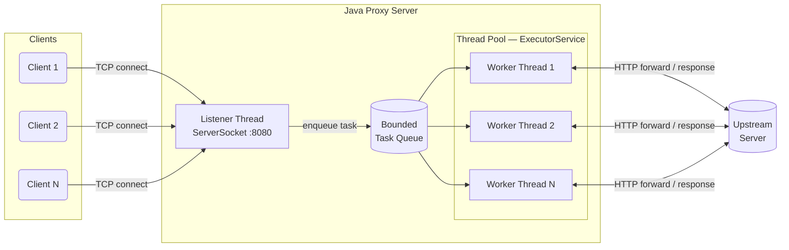
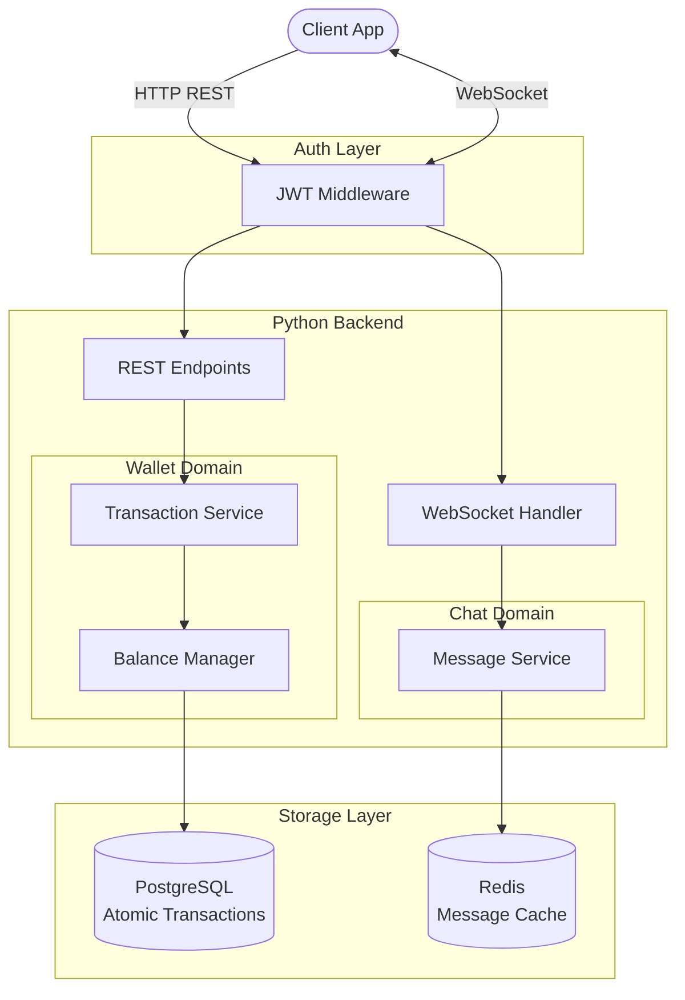
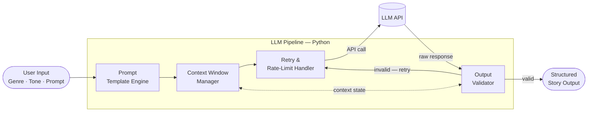
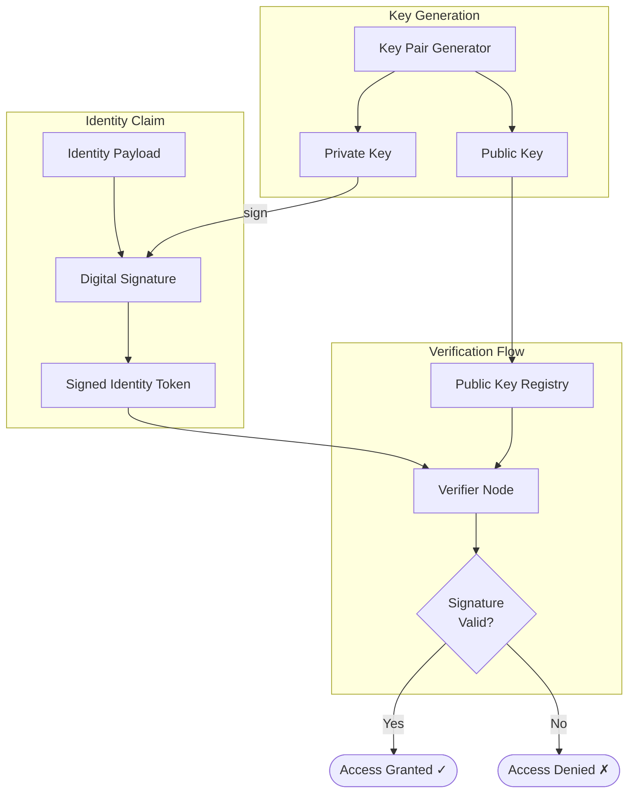

<div align="center">


<br/>

[](https://github.com/Vishwanath090)

<br/>

[](https://www.linkedin.com/in/vishwanath-biradar-582b502a9/)
[](mailto:vishwanathsbiradar1@gmail.com)
[](https://x.com/Vishwanath_Birdr)
[](https://www.instagram.com/__vishwanath__.biradar/)
&nbsp;&nbsp;
[](https://github.com/Vishwanath090)

</div>

<br/>

---

## ⚡ About

Backend engineer focused on **distributed systems**, **high-throughput APIs**, and the infrastructure layer that makes AI features production-ready. My stack is Java and Python; my interest is in the parts that are actually hard — correctness under concurrency, failure-tolerant service design, and integrating language models as first-class backend services rather than fragile afterthoughts.

I think from first principles: before writing code, I can reason through the data flow, name the bottleneck, and pick the consistency model that fits the problem. That habit comes from building close to the metal — HTTP proxies from raw sockets, financial backends where atomicity is non-negotiable, and LLM pipelines engineered to hold up under real conditions.

```java
class Vishwanath {

    String[]  stack  = { "Java", "Python", "JavaScript" };
    String[]  focus  = { "Distributed Systems", "RAG Pipelines", "Scalable Backend Architecture" };
    String[]  values = { "Correctness before speed", "Depth over surface coverage", "Build to understand" };

    boolean   openToWork    = true;
    String[]  targetRoles   = { "Backend Engineer", "SDE", "AI / LLM Infrastructure" };
}
```

<br/>

---

## 🔨 Currently Building

```text
→  RAG pipeline with hybrid retrieval (dense + sparse) and cross-encoder re-ranking
→  LLM inference microservice — structured JSON output, retry logic, rate-limit handling
→  Studying Raft consensus — leader election, log replication, and split-brain prevention
→  Reactive Java backends with Project Reactor — non-blocking I/O from the ground up
```

<br/>

---

## 🛠 Tech Stack

#### Backend Engineering


#### APIs, Messaging & Real-time


#### Databases & Storage


#### Applied AI / ML


#### DevOps & Tooling


<br/>

---

## 🚀 Featured Projects

<table>
  <tr>
    <td width="50%" valign="top">
      <h3>🔧 Multithreaded HTTP Proxy Server</h3>
      <p>
        
        
        
      </p>
      <p>Built from raw sockets in Java — no frameworks, no abstractions between the code and the OS. The core challenge: designing a thread pool that handles bursty concurrent connections without starvation, lock contention, or dropped requests.</p>
      <p>This project forced a real understanding of Java concurrency internals — how <code>ExecutorService</code> queuing works, where <code>synchronized</code> becomes a bottleneck, and how to write I/O-safe concurrent code without introducing race conditions. The kind of work that separates engineers who <em>use</em> threads from engineers who <em>understand</em> them.</p>
      <a href="https://github.com/vishwanath090/multithreaded-http-proxy-server">
        
      </a>
    </td>
    <td width="50%" valign="top">
      <h3>💳 Payment Wallet + Real-Time Chat</h3>
      <p>
        
        
        
      </p>
      <p>A production-modelled backend where the hard problem wasn't building the features — it was keeping two systems with incompatible consistency requirements from coupling their failure modes.</p>
      <p>The wallet layer demands atomic, idempotent transactions. The chat layer is async, stateful, and eventually consistent. Separating these domains clearly — distinct write paths, independent error handling, shared JWT auth — is the architectural decision that makes this system correct under load. Domain-driven design applied to a real constraint.</p>
      <a href="https://github.com/vishwanath090/payment-wallet-chat-backend">
        
      </a>
    </td>
  </tr>
  <tr>
    <td width="50%" valign="top">
      <h3>🤖 AI Story Generator</h3>
      <p>
        
        
        
      </p>
      <p>The challenge of building on language models isn't calling the API — it's building the engineering layer that makes non-deterministic output reliable. This project is that layer: structured prompt templates, context window management, multi-turn state tracking, and output validation.</p>
      <p>The patterns here — prompt chaining, graceful fallback, output parsing — map directly to how production RAG systems and agentic backends are architected. Applied AI/ML in the truest sense: not the model, but the system around it.</p>
      <a href="https://github.com/vishwanath090/Ai_Story_Generator-">
        
      </a>
    </td>
    <td width="50%" valign="top">
      <h3>🔐 Decentralised Identity Verification</h3>
      <p>
        
        
        
      </p>
      <p>An identity verification system built on cryptographic primitives rather than a central authority. Implements digital signature chains to establish provenance and trust — no trusted third party required.</p>
      <p>The core insight: identity doesn't need a server, it needs a proof. A practical study in how Web3 authentication models and decentralised trust patterns can inform backend security architecture, even outside a blockchain context.</p>
      <a href="https://github.com/vishwanath090/Decentralised-Identity-Verification">
        
      </a>
    </td>
  </tr>
</table>

<br/>

---

## 🏗 System Architecture

> Architecture overviews for each project — click to expand.

<details>
<summary><b>🔧 Multithreaded HTTP Proxy Server — Request Flow & Thread Model</b></summary>

<br/>

Multiple TCP clients connect concurrently. A dedicated listener thread accepts each connection and submits a task to a bounded queue. The `ExecutorService`-backed thread pool dispatches workers; each worker owns one full request lifecycle — parse, forward, receive, respond — before returning to the pool.



**Design decisions:** Bounded queue prevents memory exhaustion under burst traffic. Workers are stateless — no shared mutable state between them. `synchronized` used surgically only on truly shared resources; lock-free patterns everywhere else.

</details>

<br/>

<details>
<summary><b>💳 Payment Wallet + Real-Time Chat — Domain-Separated Backend</b></summary>

<br/>

All traffic passes through a shared JWT auth layer. After validation, the REST and WebSocket paths diverge completely — each domain writes to its own store with its own consistency model. The wallet is atomic and idempotent; the chat layer is async and eventually consistent. These failure modes never touch each other.



**Design decisions:** Wallet operations use DB-level transactions for balance atomicity and double-spend prevention. Chat uses Redis for low-latency message delivery — durability is secondary to throughput. Shared auth boundary; zero shared business logic between domains.

</details>

<br/>

<details>
<summary><b>🤖 AI Story Generator — LLM Pipeline with Retry & Validation Loop</b></summary>

<br/>

User input enters a prompt template engine that structures the generation request. A context window manager tracks multi-turn state without exceeding token limits. The retry handler calls the LLM API and feeds the raw response to an output validator — invalid or malformed outputs loop back with adjusted prompts; valid outputs are returned as structured story content.



**Design decisions:** Prompt templates enforce structural constraints to reduce hallucination drift. Context manager prevents token overflow by truncating or summarising earlier turns. Output validator applies schema and coherence checks before accepting any generation — retry logic backs off on rate limits and adjusts temperature on repeated failures.

</details>

<br/>

<details>
<summary><b>🔐 Decentralised Identity Verification — Cryptographic Trust Model</b></summary>

<br/>

Identity is established through cryptographic proof, not a trusted third party. A key pair generator produces public/private keys. The user signs an identity payload with their private key to produce a signed token. Verifier nodes validate the signature against a public key registry — no central server is in the verification path.



**Design decisions:** No central authority in the critical verification path — trust is purely a function of cryptographic proof. Public keys are the only shared state. Signature chains enable claim delegation and revocation without server dependency. Architecture mirrors W3C Decentralised Identifiers (DIDs) and Verifiable Credentials at the conceptual level.

</details>

<br/>

---

## 📊 GitHub Stats

<div align="center">


&nbsp;&nbsp;


<br/><br/>


</div>

<br/>

---

## 🏆 Achievements

<div align="center">


</div>

<br/>

---

## 📈 Contribution Graph

<div align="center">


</div>

<br/>

---

<div align="center">

**Open to backend engineering, SDE, and AI/LLM infrastructure roles.**

[vishwanathsbiradar1@gmail.com](mailto:vishwanathsbiradar1@gmail.com) &nbsp;·&nbsp; [LinkedIn](https://www.linkedin.com/in/vishwanath-biradar-582b502a9/) &nbsp;·&nbsp; [GitHub @Vishwanath090](https://github.com/Vishwanath090)

<br/>


</div>
